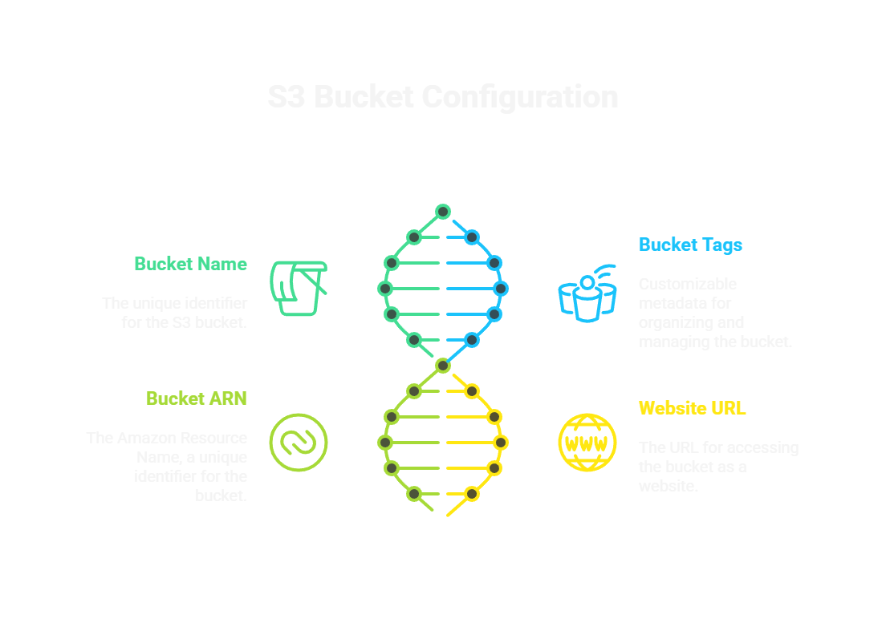
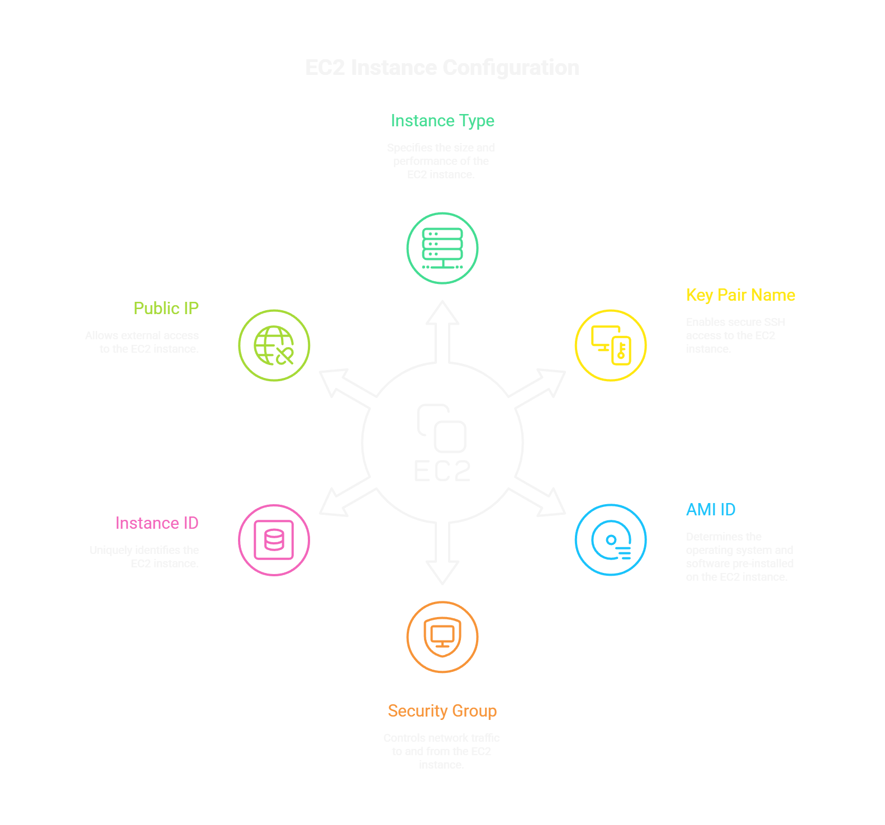
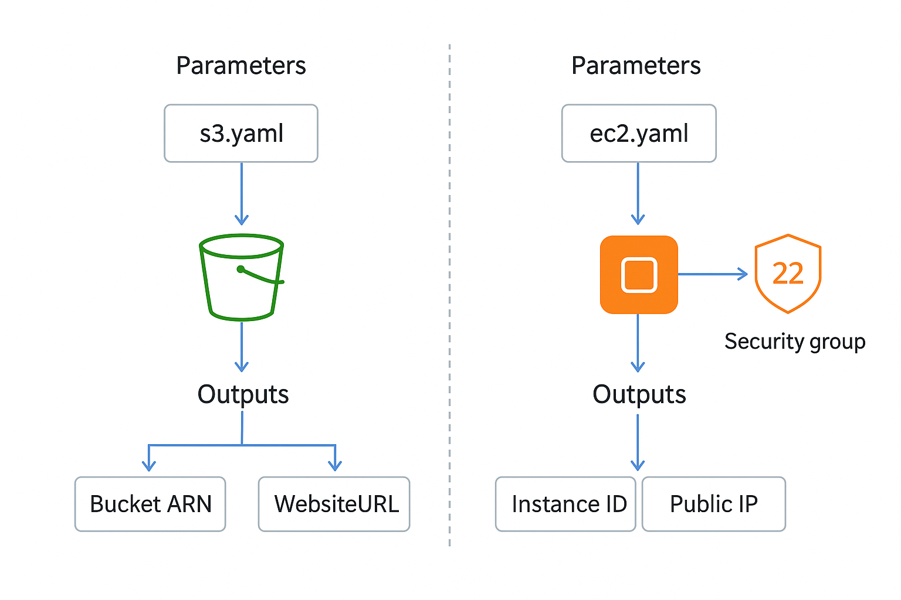

# 🌩️ AWS CloudFormation Examples

This repository contains **AWS CloudFormation templates** for deploying common AWS resources such as **S3** and **EC2**.  
Each template is simple, reusable, and easy to customize.  

---

## 📂 Templates Overview  

### 🪣 S3 Bucket  
Creates an S3 bucket with customizable **name** and **tags**.  

<p align="center">
  
</p>

---

### 💻 EC2 Instance  
Creates an EC2 instance with an associated **Security Group** that allows SSH access.  

<p align="center">
  
</p>

---

## ⚙️ Usage  

1. Ensure you have AWS CLI configured with the right permissions.  
2. Deploy a template via the AWS Console or CLI:  

   ```bash
   aws cloudformation create-stack --stack-name my-stack --template-body file://template.yaml
   ```

   Replace `template.yaml` with the template file you want (e.g., `s3.yaml` or `ec2.yaml`).

---

## 🔧 Parameters

<p align="center">  </p>

**For s3.yaml:**

- `s3BucketName`: Name of the S3 bucket (default: cloudformation-s3-bucket-prajwal)

**For ec2.yaml:**

- `InstanceName`: Name of the EC2 instance (default: MyEC2Instance)
- `InstanceType`: EC2 instance type (default: t3.micro)
- `KeyName`: Existing EC2 KeyPair (default: devops-intern)
- `ImageId`: AMI ID (default: ami-02d26659fd82cf299)

---

## 📤 Outputs

**s3.yaml:**
- `Arn`: ARN of the created S3 bucket
- `WebsiteURL`: Website URL of the S3 bucket

**ec2.yaml:**
- `InstanceId`: ID of the created EC2 instance
- `PublicIP`: Public IP address of the EC2 instance

---

## 🤝 Contributing

Got a new template idea? Submit a PR and help grow this repo into a CloudFormation reference hub 🚀
